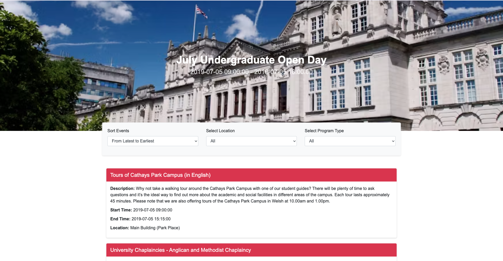
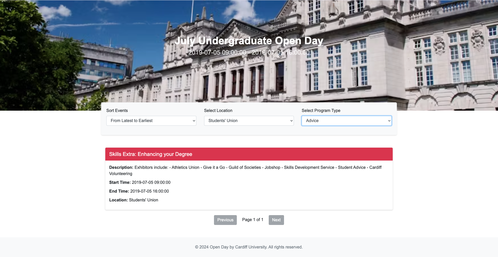

### About This Project
This project is for a coding exercise of JavaScript and JSON parsing 
### Setting Up
#### Clone the Repository
1. Open a terminal window.
2. Navigate to the directory where you want to clone the project files.
3. Use the following command
```
git clone https://github.com/lylali/open-day-data-query.git
```
#### Running the Project
1. Open a terminal window.
2. Navigate to the directory containing the project files (HTML, CSS, JS).
3. Install http-server globally if you haven't already:
```
npm install -g http-server
```
4. Run the following command to start the local server:
```
http-server
```
5. By default, http-server will start on port 8080. Open http://localhost:8080 in your web browser to view your project.

### Screenshots


